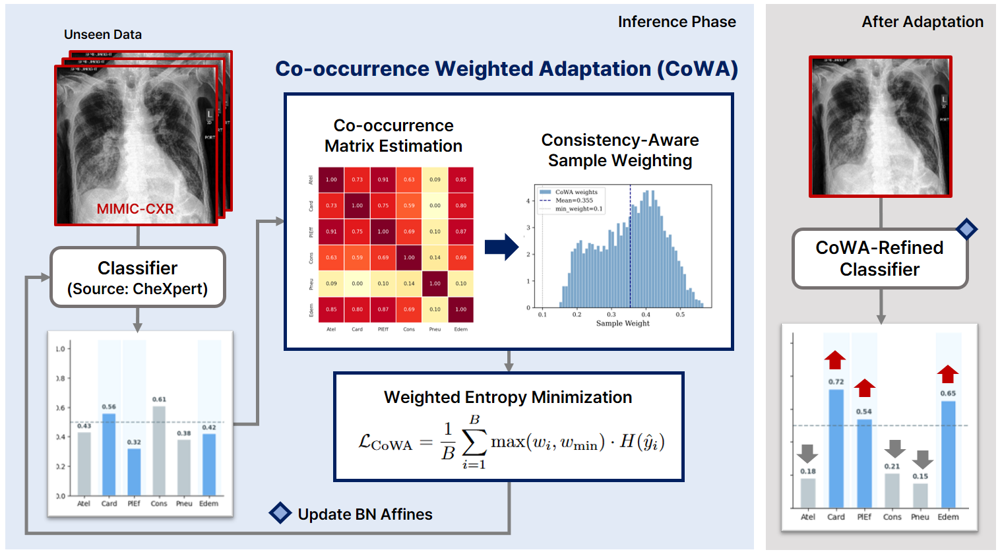

# Leveraging Pathology Co-occurrence for Test-Time Adaptation in Chest X-Ray Diagnosis

This repository contains the official implementation of the MICCAI 2026 paper
"Leveraging Pathology Co-occurrence for Test-Time Adaptation in Chest X-Ray
Diagnosis", which proposes **CoWA (Co-occurrence Weighted Adaptation)**.

## Overview

CoWA is a source-free test-time adaptation method for multi-label chest X-ray
classification. It estimates the target-domain pathology co-occurrence matrix
from model predictions and uses it as a per-sample reliability signal: samples
whose predicted label structure is consistent with the estimated co-occurrence
pattern are up-weighted in entropy minimization, while inconsistent ones are
down-weighted. Only the BN affine parameters are adapted.

<p align="center">
  
</p>

## Installation

```bash
# Clone the repository
git clone https://github.com/woojin716/CoWA.git
cd CoWA

# Create an environment
python -m venv .venv && source .venv/bin/activate

# Install requirements
pip install -r requirements.txt
```

Tested with Python 3.10, PyTorch 2.x, and a single NVIDIA GPU.

## Data

### Quick path: pre-processed test tensors

To skip raw data download and torchxrayvision preprocessing, we provide cached
test tensors (one `.pt` per dataset, xrayvision-preprocessed and ready to
consume).

**Download**: https://drive.google.com/drive/folders/1Gtdlwx-TKqgvJYOSlcSj3jgxaQSYzyBp?usp=drive_link

After download, place the files so the layout is:

```
CoWA/
└── data/
    ├── testset_chexpert.pt
    ├── testset_mimic.pt
    ├── testset_nih.pt
    └── testset_vindr.pt
```

This matches the default `--cache-dir ./data` in the runners. The `data/`
directory is gitignored — these files live outside version control.

### Source-domain classifiers

Source models are loaded via torchxrayvision and **download automatically on
first run** (no manual setup needed):

| Source key | torchxrayvision weights       |
|------------|-------------------------------|
| `chexpert` | `densenet121-res224-chex`     |
| `mimic_ch` | `densenet121-res224-mimic_ch` |
| `nih`      | `densenet121-res224-nih`      |

### Full reproduction from raw data (optional)

If you prefer to rebuild the test tensors yourself, download the original
datasets:

- **CheXpert** — https://stanfordmlgroup.github.io/competitions/chexpert/
- **MIMIC-CXR** — https://physionet.org/content/mimic-cxr/
- **NIH ChestX-ray14** — https://nihcc.app.box.com/v/ChestXray-NIHCC
- **VinDr-CXR** — https://physionet.org/content/vindr-cxr/

Loaders in [src/data.py](src/data.py) build a deterministic stratified split
with `random_seed=42`. MIMIC-CXR uses the official PhysioNet split
(`mimic-cxr-2.0.0-split.csv.gz`).

## Experiments

All commands assume the project root as the working directory.

### Single run

```bash
python src/run_cowa.py \
    --source mimic_ch --target chexpert \
    --batch-size 32 --device cuda
```

### Sweeps

```bash
# CoWA over all source–target combos
bash scripts/run_ours_all.sh <exp_id> <batch_size>

# Baselines over all source–target combos
bash scripts/run_baseline_all.sh <exp_id> <batch_size> <device> <seeds>
```

Each invocation auto-creates a fresh run directory at `results/<YYYYMMDD>/<NNN>/`
(NNN = next 3-digit index). The sweep scripts bundle a whole sweep into a single
run directory.

## Citation

If you find this work useful, please cite our paper:

```
TBD
```
